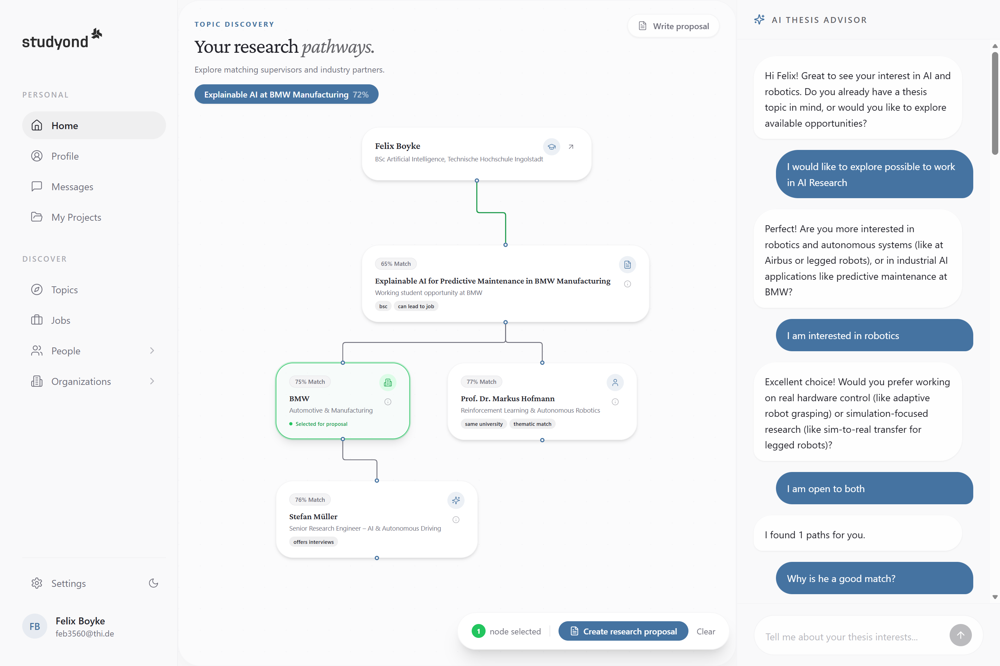
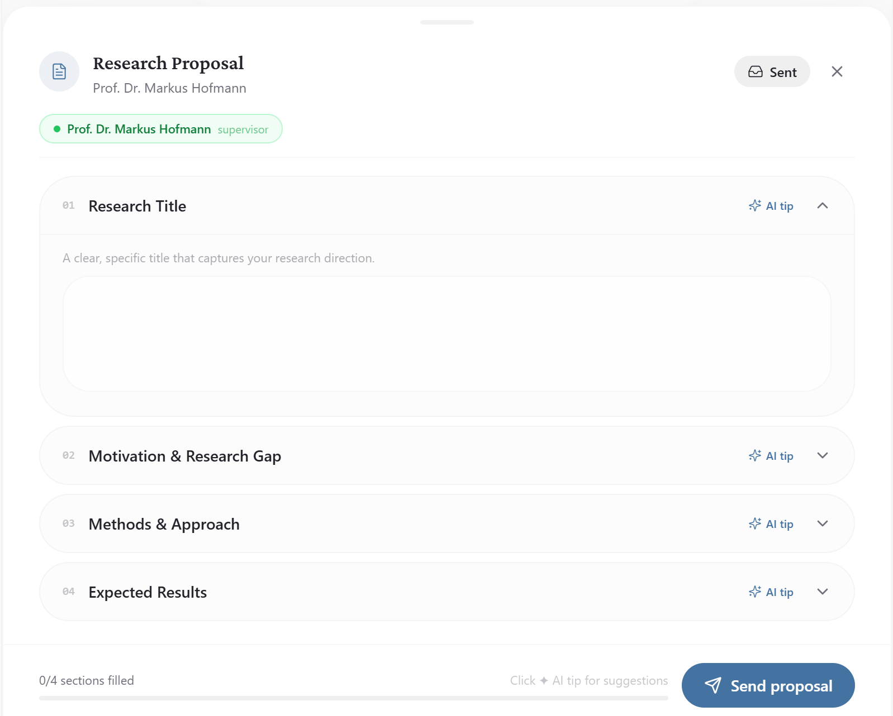

# byte-bicep — Start Hack 2026

An AI-powered Thesis Journey built for the **Studyond** challenge at START Hack 2026.

Students chat with an AI advisor that progressively learns about their interests, skills, and career goals through natural, LLM-driven dialogue. The advisor asks targeted follow-up questions based on what it already knows, building a rich student profile before generating a personalized, interactive graph of thesis pathways — combining matching topics, supervisors, companies, and industry experts, each scored with AI confidence ratings.

## Team

| GitHub | Role |
|--------|------|
| [MrFleix](https://github.com/MrFleix) | Backend, Architecture |
| [Chipi8704](https://github.com/Chipi8704) | Frontend, Architecture |
| [nicoe64](https://github.com/nicoe64) | Design |
| [Metax0](https://github.com/Metax0) | Planning, General |




From the graph, students can explore their options in depth, select entities that interest them, and draft research proposals with AI assistance. A profile dashboard provides ranked statistics across companies, supervisors, and thesis topics based on compatibility with the student's profile.



**Key features:**
- LLM-driven conversational advisor that progressively builds a student profile through adaptive dialogue
- RAG-powered candidate search across 140+ real platform entities using semantic embeddings
- Interactive graph with multi-path exploration and node selection
- Research proposal editor with field-by-field AI guidance
- Live graph refinement — tell the AI you want a different direction and the graph updates instantly
- Profile dashboard with match distribution charts 

---

## Setup
```bash
python3.11 -m venv venv
source venv/bin/activate        # macOS / Linux
# venv\Scripts\activate         # Windows
pip install -r requirements.txt
```

## Starting Frontend
```bash
Install: https://nodejs.org/en/download
You have to open a new console and test with | npm -version
cd Frontend
npm install
npm run dev
```

## Starting Backend
```bash
cd backend
uvicorn app.main:app --reload --port 8000
```
